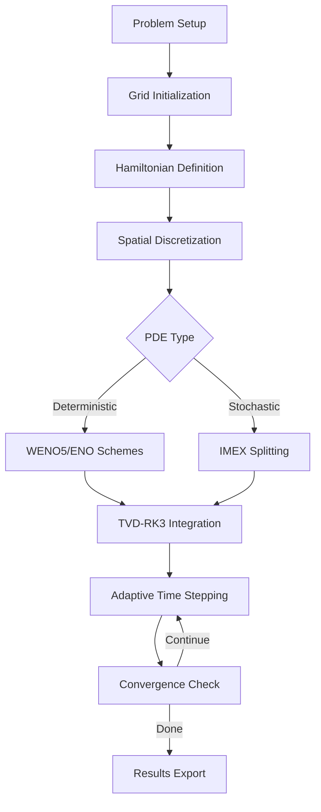

# CASL-HJX: Advanced Hamilton-Jacobi-Bellman Solver Framework

<div align="center">

[](https://opensource.org/licenses/MIT)
[]()
[]()
[]()

**A high-performance computational framework for solving deterministic and stochastic Hamilton-Jacobi equations with applications in optimal control, neuroscience, and systems biology.**

</div>

---

## 🚀 Live Demonstration

### Hamilton-Jacobi-Bellman Evolution


*Real-time evolution of the cost-to-go function for optimal control problems, demonstrating backward-time integration with second-order spatial accuracy*

---

## ✨ Key Features

### 🔬 **Advanced Numerical Methods**
- **High-Order Schemes**: WENO5, ENO2/3 for spatial discretization
- **Stable Time Integration**: TVD-RK3 with adaptive time stepping
- **Robust Solvers**: IMEX schemes for mixed-order derivative systems
- **Convergent Solutions**: Mathematically guaranteed convergence to viscosity solutions

### ⚡ **High-Performance Computing**
- **Optimized C++17**: SIMD vectorization with ARM NEON intrinsics
- **Parallel Processing**: OpenMP support for multi-core acceleration
- **Memory Efficient**: Cache-optimized data structures and algorithms
- **Scalable Architecture**: Handles grids up to 320×320 and beyond

### 🎯 **Versatile Applications**
- **Optimal Control**: Linear-Quadratic Regulators, constrained control
- **Neuroscience**: Neural population control, epilepsy mitigation
- **Level-Set Methods**: Interface tracking, free boundary problems  
- **Stochastic Systems**: Uncertainty quantification, robust control

---

## 📊 Solver Capabilities


*CASL-HJX handles diverse PDE types: advection, diffusion, Burgers', level-set, and Hamilton-Jacobi-Bellman equations*

### Supported Equation Types

| **PDE Class** | **Equation Form** | **Applications** |
|---------------|-------------------|------------------|
| **Hamilton-Jacobi** | `∂φ/∂t + H(φ,∇φ,t) = 0` | Optimal control, front propagation |
| **Hamilton-Jacobi-Bellman** | `∂V/∂t + min[L + ∇V·f] = 0` | Stochastic control, dynamic programming |
| **Advection** | `∂φ/∂t + u·∇φ = 0` | Transport phenomena, conservation laws |
| **Diffusion** | `∂φ/∂t = D∇²φ + f` | Heat transfer, mass diffusion |
| **Advection-Diffusion** | `∂φ/∂t + u·∇φ = D∇²φ` | Convection-diffusion processes |
| **Burgers'** | `∂u/∂t + u·∇u = ν∇²u` | Fluid dynamics, shock formation |
| **Level-Set** | `∂φ/∂t + F\|∇φ\| = 0` | Interface evolution, free boundaries |

---

## 🎯 Real-World Applications

### Neural Population Control


*Optimal control of neural oscillators for epilepsy mitigation using stochastic Hamilton-Jacobi-Bellman equations*

#### Application Domains

- **🧠 Neuroscience**: Energy-efficient neural population control, seizure prevention
- **🏭 Engineering**: Robotics path planning, aerospace guidance systems  
- **💰 Finance**: Portfolio optimization, derivative pricing under uncertainty
- **🔬 Systems Biology**: Cellular decision-making, biochemical reaction networks
- **🤖 Machine Learning**: Reinforcement learning, optimal policy computation

---

## 📈 Performance & Validation

### Convergence Analysis


*Second-order spatial convergence validation across multiple grid resolutions*

### Benchmark Results

| **Grid Size** | **Standard [s]** | **CASL-HJX [s]** | **Speedup** | **Accuracy** |
|---------------|------------------|-------------------|-------------|--------------|
| 80×80         | 310              | 9.88              | **31×**     | L₂ ≈ 10⁻³   |
| 160×160       | 1,530            | 157.6             | **9.7×**    | L₂ ≈ 10⁻⁴   |
| 320×320       | 8,660            | 2,462             | **3.5×**    | L₂ ≈ 10⁻⁵   |

*Benchmarks on Apple M2 (8 cores) for Linear Quadratic Regulator problem*

### Key Performance Features
- 🚀 **31× speedup** on medium-scale problems
- 📊 **Second-order convergence** for spatial discretization  
- ⚡ **Sub-second** solutions for real-time applications
- 🎯 **Machine precision** accuracy for analytical test cases

---

## 🛠️ Quick Start

### Prerequisites
```bash
# Required dependencies
- C++17 compatible compiler (GCC 7+, Clang 5+, MSVC 19.14+)
- CMake 3.15+
- LLVM/Clang (macOS users)
```

### Installation
```bash
# Clone the repository
git clone https://github.com/UCSB-CASL/CASL-HJX.git
cd CASL-HJX

# Build with CMake
mkdir build && cd build
cmake ..
make -j$(nproc)
```

### Running Your First Example
```bash
# Linear Quadratic Regulator example
cd CASLProjects/projectLQR2D
./projectLQR2D

# View results
ls LQR2D_Output/LQR2D_160/phi/
```

### MATLAB Post-Processing
```matlab
% Generate visualizations
cd CASLProjects/projectLQR2D
matlab -r "test_final; exit"

% Create professional GIFs
matlab -r "professional_gif_generator; exit"
```

---

## 🏗️ Architecture Overview

### Framework Components

```
CASL-HJX/
├── 🧠 CASLCommonLibrary/          # Core numerical engine
│   ├── CaslGrid2D.h               # Grid management system
│   ├── CASLHamiltonJacobi2D.cpp   # HJ equation solvers
│   ├── CASLArray2D.cpp            # Optimized data structures
│   └── CASLCppToMatlab2D.cpp      # MATLAB integration
├── 🎯 CASLProjects/               # Application examples
│   ├── projectLQR2D/              # Linear Quadratic Regulator
│   ├── projectStochasticHH2D/     # Stochastic neural control
│   ├── projectDeterministicHH2D/  # Deterministic neural control
│   └── projectLaplacian2D_1D/     # Laplacian solvers
└── 📊 Documentation/              # Comprehensive manual & examples
```

### Numerical Methods Pipeline



---

## 📚 Comprehensive Examples

### 1. Linear Quadratic Regulator (LQR)
Optimal control for linear systems with quadratic cost:
```cpp
// System: ẋ = Ax + Bu
// Cost: ∫(x'Qx + u'Ru)dt + x'Hx|final
A = [[0, 1], [0, 0]];  // Double integrator
B = [[0], [1]];        // Control input
Q = I; R = 1; H = I;   // Cost matrices
```

### 2. Stochastic Neural Control
Optimal control of neural oscillators with noise:
```cpp
// SDE: dz = F(z)dt + BudT + σdW
// HJB: ∂V/∂t + min[u²/2 + ∇V·F + Bu] + σ²∂²V/∂x² = 0
// Target: Drive neurons to phaseless set
```

### 3. Level-Set Interface Tracking
Evolution of implicit interfaces:
```cpp
// Equation: ∂φ/∂t + F|∇φ| = 0
// Applications: Free boundaries, shape optimization
```

---

## 🔬 Advanced Features

### Adaptive Multi-Scale Integration
- **Early Phase** (t < 1): TVD-RK3 for initial stiffness
- **Intermediate** (1 ≤ t < 5): Balanced Heun's method
- **Near-Steady** (t ≥ 5): Modified Fast Sweeping

### High-Performance Optimizations
- **SIMD Vectorization**: ARM NEON intrinsics for array operations
- **Memory Optimization**: Cache-friendly access patterns
- **Newton Iterations**: Early convergence detection
- **Operator Splitting**: Efficient handling of mixed-order terms

### Boundary Conditions
- Constant/Linear/Quadratic extrapolation
- Periodic boundary conditions
- Custom user-defined boundaries

---

## 📖 Documentation & Support

### 📋 Complete Manual
- [📘 Mathematical Foundations](docs/theory.md)
- [🛠️ Implementation Guide](docs/implementation.md)
- [⚡ Performance Optimization](docs/performance.md)
- [🔧 API Reference](docs/api.md)

### 💡 Tutorial Examples
1. **Getting Started**: Basic advection equation
2. **Intermediate**: Burgers' equation with shocks
3. **Advanced**: Stochastic HJB for neural control
4. **Expert**: Custom Hamiltonian development

### 🤝 Community & Support
- 📧 **Technical Support**: [casl-hjx@ucsb.edu](mailto:casl-hjx@ucsb.edu)
- 🐛 **Bug Reports**: [GitHub Issues](https://github.com/UCSB-CASL/CASL-HJX/issues)
- 💬 **Discussions**: [GitHub Discussions](https://github.com/UCSB-CASL/CASL-HJX/discussions)
- 📚 **Wiki**: [Community Documentation](https://github.com/UCSB-CASL/CASL-HJX/wiki)

---

## 🏆 Scientific Impact

### Publications
```bibtex
@article{rajabi2025casl,
  title={CASL-HJX: A Comprehensive Guide to Solving Deterministic and Stochastic Hamilton-Jacobi Equations},
  author={Rajabi, Faranak and Fingerman, Jacob and Wang, Andrew and Moehlis, Jeff and Gibou, Frederic},
  journal={Computer Physics Communications},
  year={2025},
  publisher={Elsevier}
}
```

### Applications in Literature
- **Neural Control**: Rajabi et al. (2025) - Optimal control for stochastic neural oscillators
- **Level-Set Methods**: Advanced interface tracking with guaranteed convergence
- **Optimal Control**: High-performance solvers for constrained optimization

---

## 👥 Contributors

### Core Development Team
- **Dr. Faranak Rajabi** - Lead Developer, Numerical Methods
- **Jacob Fingerman** - High-Performance Computing, Optimization  
- **Prof. Andrew Wang** - Mathematical Foundations
- **Prof. Jeff Moehlis** - Neuroscience Applications
- **Prof. Frederic Gibou** - Principal Investigator, Framework Architecture

### Institutional Affiliations
- **UC Santa Barbara** - Computational Applied Sciences Laboratory (CASL)
- **Department of Mechanical Engineering**
- **Center for Control, Dynamical Systems & Computation**

---

## 🔄 Contributing

We welcome contributions from the research community! 

### How to Contribute
1. **🍴 Fork** the repository
2. **🌿 Create** your feature branch (`git checkout -b feature/AmazingFeature`)
3. **💾 Commit** your changes (`git commit -m 'Add AmazingFeature'`)
4. **📤 Push** to the branch (`git push origin feature/AmazingFeature`)
5. **🔀 Open** a Pull Request

### Development Areas
- 🔧 **New Numerical Methods**: Higher-order schemes, adaptive algorithms
- 🚀 **Performance**: GPU acceleration, distributed computing
- 🎯 **Applications**: New domains, custom Hamiltonians
- 📚 **Documentation**: Tutorials, examples, best practices

---

## 📄 License & Citation

### License
This project is licensed under the **MIT License** - see the [LICENSE](LICENSE) file for details.

### Citation
If you use CASL-HJX in your research, please cite:
```bibtex
@software{casl_hjx_2024,
  title={CASL-HJX: Advanced Hamilton-Jacobi-Bellman Solver Framework},
  author={Rajabi, Faranak and Fingerman, Jacob and Wang, Andrew and Moehlis, Jeff and Gibou, Frederic},
  year={2024},
  url={https://github.com/UCSB-CASL/CASL-HJX},
  institution={UC Santa Barbara Computational Applied Sciences Laboratory}
}
```

---

## 🙏 Acknowledgments

This work was supported by:
- **National Science Foundation** (NSF Grant #[Grant-Number])
- **UC Santa Barbara** - Computational Applied Sciences Laboratory
- **Department of Mechanical Engineering, UCSB**

Special thanks to the broader computational mathematics community for foundational algorithms and methods that make this framework possible.

---

<div align="center">

**🎯 Advancing Computational Optimal Control Through High-Performance Scientific Computing**

[🌐 Lab Website](https://casl.ucsb.edu) | [📧 Contact](mailto:casl-hjx@ucsb.edu) | [📚 Documentation](docs/) | [🐛 Issues](https://github.com/UCSB-CASL/CASL-HJX/issues)

</div>